# Square Attack: a query-efficient black-box adversarial attack via random search
**ECCV 2020**

**Maksym Andriushchenko\*, Francesco Croce\*, Nicolas Flammarion, Matthias Hein**

**EPFL, University of Tübingen**

**Paper:** [https://arxiv.org/abs/1912.00049](https://arxiv.org/abs/1912.00049)

\* denotes equal contribution


## News
+ [Jul 2020] The paper is accepted at **ECCV 2020**! Please stop by our virtual poster for the latest insights in black-box adversarial attacks (also check out our recent preprint [Sparse-RS paper](https://arxiv.org/abs/2006.12834) where we use random search for sparse attacks).
+ [Mar 2020] Our attack is now part of [AutoAttack](https://github.com/fra31/auto-attack), an ensemble of attacks used
for automatic (i.e., no hyperparameter tuning needed) robustness evaluation. Table 2 in the [AutoAttack paper](https://arxiv.org/abs/2003.01690) 
shows that at least on 6 models our **black-box** attack outperforms gradient-based methods. Always useful to have a black-box attack to prevent inaccurate robustness claims!
+ [Mar 2020] We also achieve the best results on [TRADES MNIST benchmark](https://github.com/yaodongyu/TRADES)!
+ [Jan 2020] The Square Attack achieves the best results on [MadryLab's MNIST challenge](https://github.com/MadryLab/mnist_challenge),
outperforming all white-box attacks! In this case we used 50 random restarts of our attack, each with a query limit of 20000.
+ [Nov 2019] The Square Attack breaks the recently proposed defense from "Bandlimiting Neural Networks Against Adversarial Attacks" 
([https://github.com/robust-ml/robust-ml.github.io/issues/15](https://github.com/robust-ml/robust-ml.github.io/issues/15)).


## Abstract
We propose the *Square Attack*, a score-based black-box L2- and Linf-adversarial attack that does not 
rely on local gradient information and thus is not affected by gradient masking. Square Attack is based on a randomized 
search scheme which selects localized square-shaped updates at random positions so that at each iteration the perturbation 
is situated approximately at the boundary of the feasible set. Our method is significantly more query efficient and achieves a higher success rate compared to the state-of-the-art 
methods, especially in the untargeted setting. In particular, on ImageNet we improve the average query efficiency in the untargeted setting for various deep networks 
by a factor of at least 1.8 and up to 3 compared to the recent state-of-the-art Linf-attack of Al-Dujaili & O’Reilly.
Moreover, although our attack is *black-box*, it can also outperform gradient-based *white-box* attacks 
on the standard benchmarks achieving a new state-of-the-art in terms of the success rate.

-----

The code of the Square Attack can be found in `square_attack_linf(...)` and `square_attack_l2(...)` in `attack.py`.\
Below we show adversarial examples generated by our method for Linf and L2 perturbations:
<p align="center">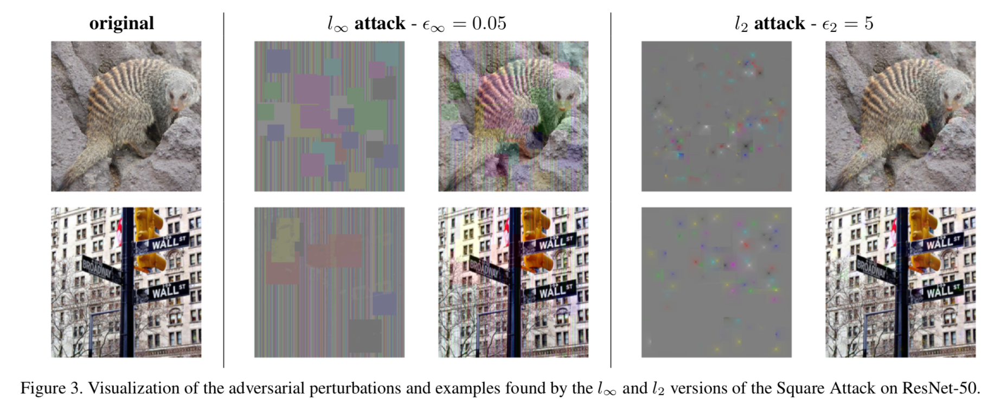</p>

<!-- 
Below we show the evolution of the images produced by the Linf (left) and L2 (right) versions of the Square Attack until misclassification is reached.
<p align="center">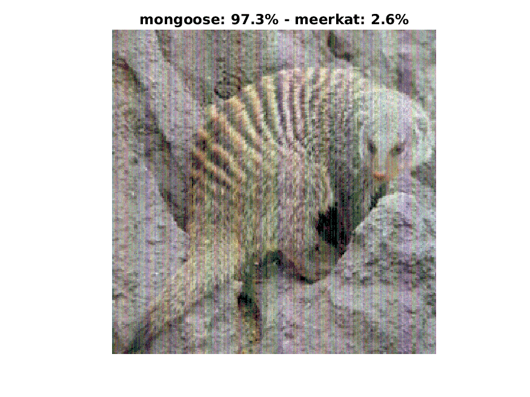 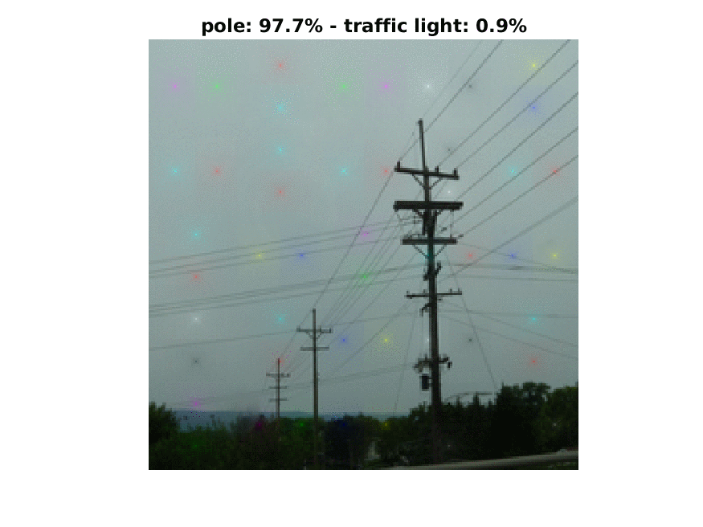 </p>  
-->


## About the paper
The general algorithm of the attack is extremely simple and relies on the random search algorithm: we try some update and
accept it only if it helps to improve the loss:
<p align="center">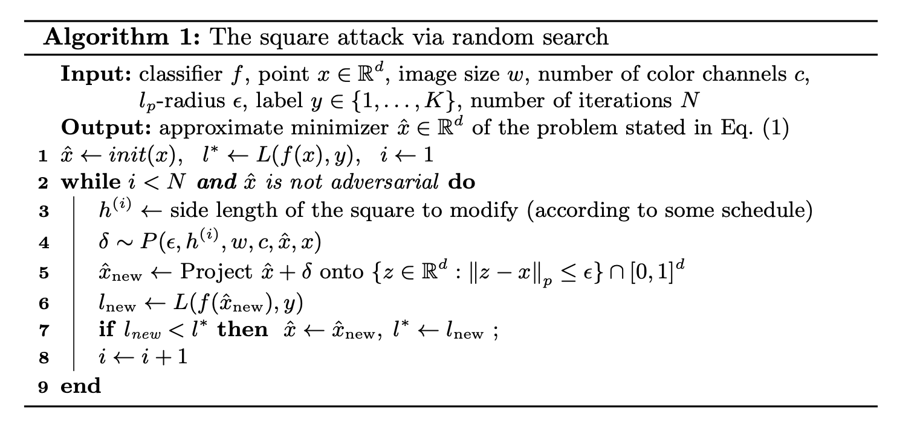</p>

The only thing we customize is the sampling distribution P (see the paper for details). The main idea behind the choice
of the sampling distributions is that:
- We start at the boundary of the feasible set with a good initialization that helps to improve the query efficiency (particularly for the Linf-attack).
- Every iteration we stay at the boundary of the feasible set by changing squared-shaped regions of the image.

In the paper we also provide convergence analysis of a variant of our attack in the non-convex setting, and justify 
the main algorithmic choices such as modifying squares and using the same sign of the update.

This simple algorithm is sufficient to significantly outperform much more complex approaches in terms of the success rate
and query efficiency:
<p align="center">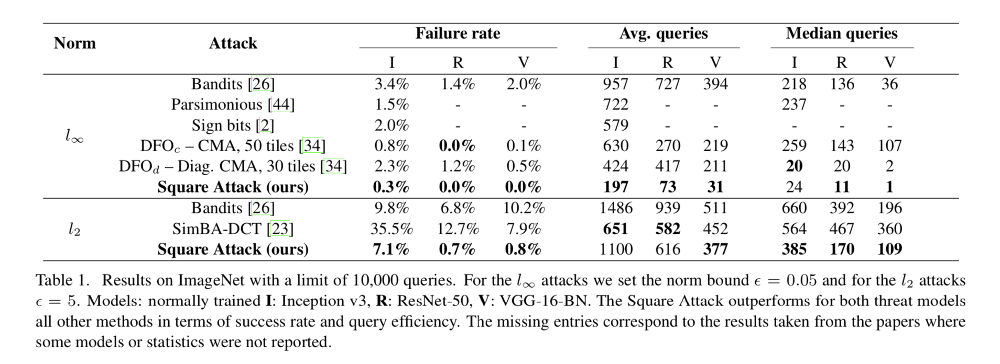</p>
<p align="center">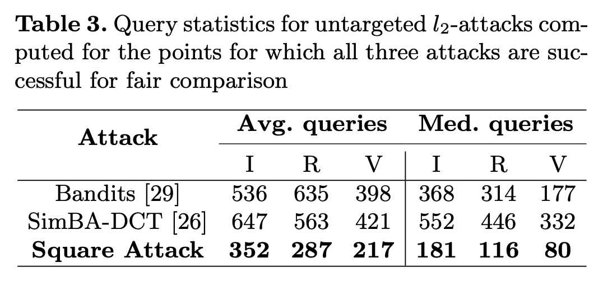</p>

Here are the complete success rate curves with respect to different number of queries. We note that the Square Attack 
also outperforms the competing approaches in the low-query regime.
<p align="center">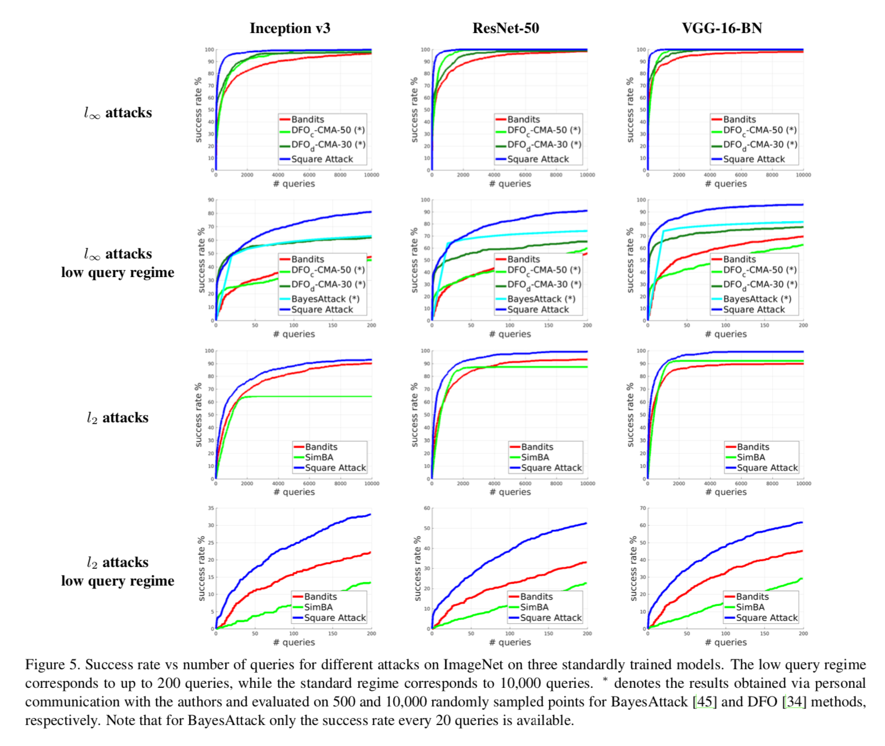</p>

The Square Attack also performs very well on adversarially trained models on MNIST achieving results competitive or 
better than *white-box* attacks despite the fact our attack is *black-box*:
<p align="center">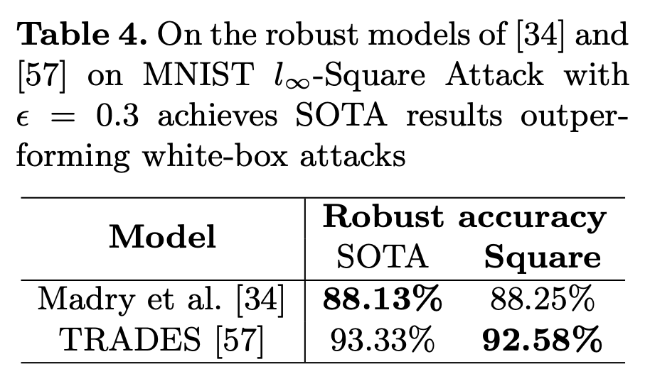</p>

Interestingly, the L2 perturbations for the Linf adversarially trained model are challenging for many attacks, including
white-box PGD, and also other black-box attacks. However, the Square Attack is able to much more accurately assess the 
robustness in this setting:
<p align="center">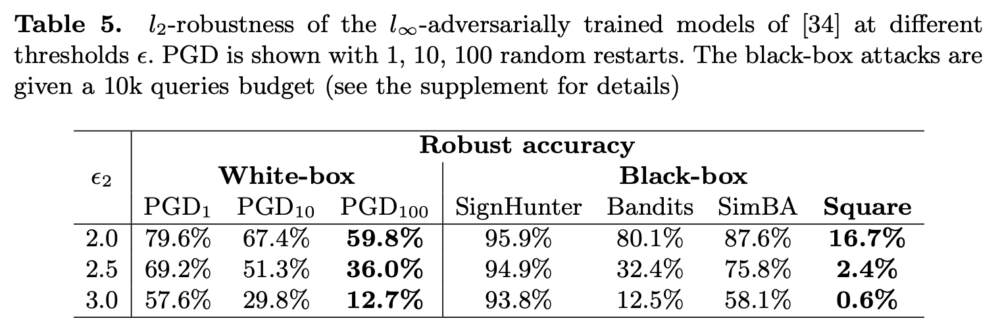</p>

<!--
The Square Attack is a useful tool to evaluate robustness of new defenses. It works even in cases when the 
white-box PGD-attack fails to accurately estimate the robustness of the model or requires many random restarts:
<p align="center">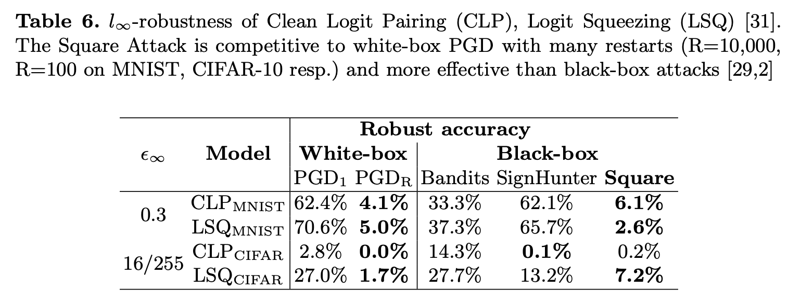</p>
<p align="center">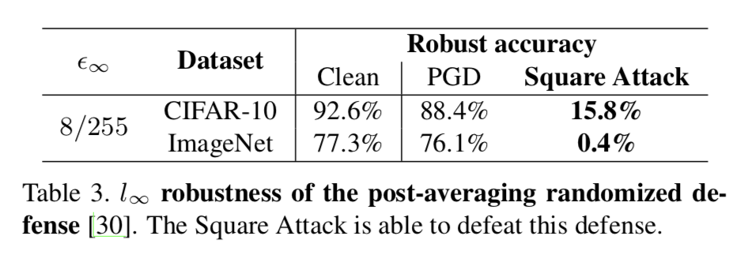</p>

An ablation study helps to understand what is particularly important for the query efficiency of our attack: 
square-shaped updates and using the same random sign inside each square. See the paper for theoretical justifications of
this choice of the updates.
<p align="center">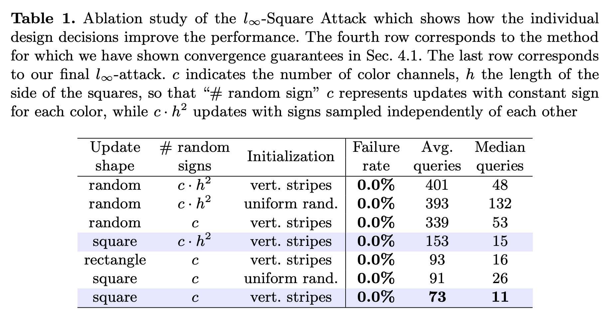</p>

Finally, we note that the attack is stable under different choices of the hyperparameter `p`. This is an important property
for the black-box setting since doing even an approximate grid search over `p` for every new model would require a lot more additional queries.
<p align="center">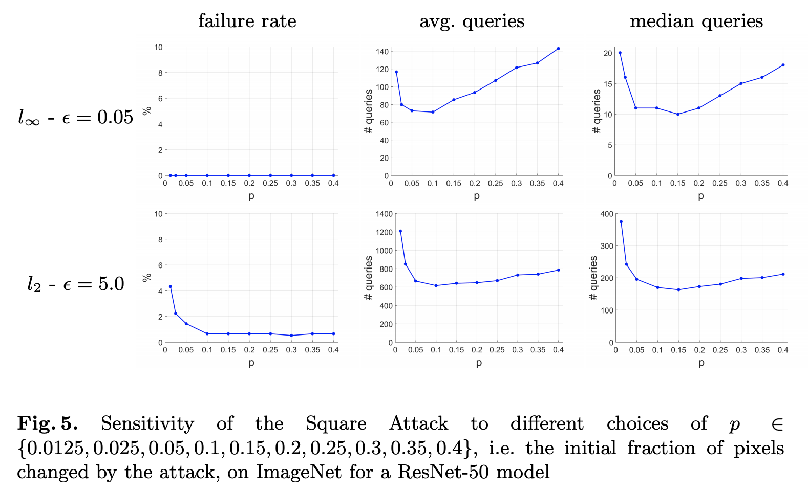</p>
-->


## Running the code
`attack.py` is the main module that implements the Square Attack, see the command line arguments there.
The main functions which implement the attack are `square_attack_linf()` and `square_attack_l2()`.

In order to run the untargeted Linf Square Attack on ImageNet models from the PyTorch repository you need to specify a correct path 
to the validation set (see `IMAGENET_PATH` in `data.py`) and then run:
- ``` python attack.py --attack=square_linf --model=pt_vgg       --n_ex=1000  --eps=12.75 --p=0.05 --n_iter=10000 ```
- ``` python attack.py --attack=square_linf --model=pt_resnet    --n_ex=1000  --eps=12.75 --p=0.05 --n_iter=10000 ```
- ``` python attack.py --attack=square_linf --model=pt_inception --n_ex=1000  --eps=12.75 --p=0.05 --n_iter=10000 ```

Note that eps=12.75 is then divided by 255, so in the end it is equal to 0.05.

For performing targeted attacks, one should use additionally the flag `--targeted`, use a lower `p`, and specify more 
iterations `--n_iter=100000` since it usually takes more iteration to achieve a misclassification to some particular, 
randomly chosen class.

The rest of the models have to downloaded first (see the instructions below), and then can be evaluated in the following way:

Post-averaging models:
- ``` python attack.py --attack=square_linf --model=pt_post_avg_cifar10  --n_ex=1000 --eps=8.0 --p=0.3 --n_iter=20000 ```
- ``` python attack.py --attack=square_linf --model=pt_post_avg_imagenet --n_ex=1000 --eps=8.0 --p=0.3 --n_iter=20000 ```

Clean logit pairing and logit squeezing models:
- ``` python attack.py --attack=square_linf --model=clp_mnist   --n_ex=1000  --eps=0.3   --p=0.3 --n_iter=20000 ```
- ``` python attack.py --attack=square_linf --model=lsq_mnist   --n_ex=1000  --eps=0.3   --p=0.3 --n_iter=20000 ```
- ``` python attack.py --attack=square_linf --model=clp_cifar10 --n_ex=1000  --eps=16.0  --p=0.3 --n_iter=20000 ```
- ``` python attack.py --attack=square_linf --model=lsq_cifar10 --n_ex=1000  --eps=16.0  --p=0.3 --n_iter=20000 ```

Adversarially trained model (with only 1 restart; note that the results in the paper are based on 50 restarts):
- ``` python attack.py --attack=square_linf --model=madry_mnist_robust --n_ex=10000 --eps=0.3 --p=0.8 --n_iter=20000 ```

The L2 Square Attack can be run similarly, but please check the recommended hyperparameters in the paper (Section B of the supplement)
and make sure that you specify the right value `eps` taking into account whether the pixels are in [0, 1] or in [0, 255] 
for a particular dataset dataset and model.
For example, for the standard ImageNet models, the correct L2 eps to specify is 1275 since after division by 255 it will become 5.0.


## Saved statistics
In the folder `metrics`, we provide saved statistics of the attack on 4 models: Inception-v3, ResNet-50, VGG-16-BN.\
Here are simple examples how to load the metrics file.

### Linf attack
To print the statistics from the last iteration:
```
metrics = np.load('metrics/2019-11-10 15:57:14 model=pt_resnet dataset=imagenet n_ex=1000 eps=12.75 p=0.05 n_iter=10000.metrics.npy')
iteration = np.argmax(metrics[:, -1])  # max time is the last available iteration
acc, acc_corr, mean_nq, mean_nq_ae, median_nq, avg_loss, time_total = metrics[iteration]
print('[iter {}] acc={:.2%} acc_corr={:.2%} avg#q={:.2f} avg#q_ae={:.2f} med#q_ae={:.2f} (p={}, n_ex={}, eps={}, {:.2f}min)'.
      format(n_iters+1, acc, acc_corr, mean_nq, mean_nq_ae, median_nq_ae, p, n_ex, eps, time_total/60))
```

Then one can also create different plots based on the data contained in `metrics`. For example, one can use `1 - acc_corr`
to plot the success rate of the Square Attack at different number of queries.

### L2 attack
In this case we provide the number of queries necessary to achieve misclassification (`n_queries[i] = 0` means that the image `i` was initially misclassified, `n_queries[i] = 10001` indicates that the attack could not find an adversarial example for the image `i`).
To load the metrics and compute the success rate of the Square Attack after `k` queries, you can run:
```
n_queries = np.load('metrics/square_l2_resnet50_queries.npy')['n_queries']
success_rate = float(((n_queries > 0) * (n_queries <= k)).sum()) / (n_queries > 0).sum()
```


## Models
Note that in order to evaluate other models, one has to first download them and move them to the folders specified in 
`model_path_dict` from `models.py`:
- [Clean Logit Pairing on MNIST](https://oc.cs.uni-saarland.de/owncloud/index.php/s/w2yegcfx8mc8kNa)
- [Logit Squeezing on MNIST](https://oc.cs.uni-saarland.de/owncloud/index.php/s/a5ZY72BDCPEtb2S)
- [Clean Logit Pairing on CIFAR-10](https://oc.cs.uni-saarland.de/owncloud/index.php/s/odcd7FgFdbqq6zL)
- [Logit Squeezing on CIFAR-10](https://oc.cs.uni-saarland.de/owncloud/index.php/s/EYnbHDeMbe4mq5M)
- MNIST, Madry adversarial training: run `python madry_mnist/fetch_model.py secret`
- MNIST, TRADES: download the [models](https://drive.google.com/file/d/1scTd9-YO3-5Ul3q5SJuRrTNX__LYLD_M) and see their [repository](https://github.com/yaodongyu/TRADES)
- [Post-averaging defense](https://github.com/YupingLin171/PostAvgDefense/blob/master/trainedModel/resnet110.th): the model can be downloaded directly from the repository

For the first 4 models, one has to additionally update the paths in the `checkpoint` file in the following way: 
```
model_checkpoint_path: "model.ckpt"
all_model_checkpoint_paths: "model.ckpt"
```


## Requirements
- PyTorch 1.0.0
- Tensorflow 1.12.0


## Contact
Do you have a problem or question regarding the code?
Please don't hesitate to open an issue or contact [Maksym Andriushchenko](https://github.com/max-andr) or 
[Francesco Croce](https://github.com/fra31) directly.


## Citation
```
@article{ACFH2020square,
  title={Square Attack: a query-efficient black-box adversarial attack via random search},
  author={Andriushchenko, Maksym and Croce, Francesco and Flammarion, Nicolas and Hein, Matthias},
  conference={ECCV},
  year={2020}
}
```
