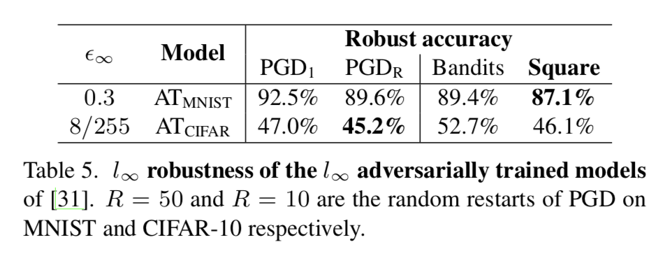
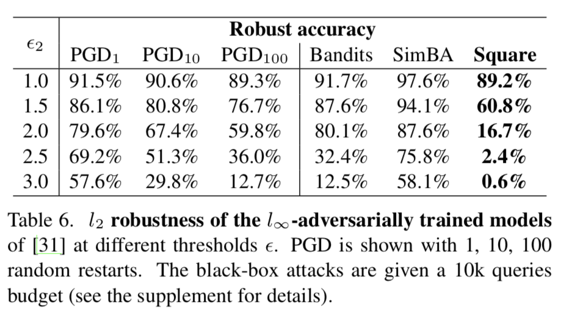

# Square Attack: a query-efficient black-box adversarial attack via random search


**Maksym Andriushchenko\*, Francesco Croce\*, Nicolas Flammarion, Matthias Hein**

**EPFL, University of Tübingen**

**Paper:** [http://arxiv.org/abs/1906.03526](http://arxiv.org/abs/1906.03526)

\* denotes equal contribution


## Abstract
We propose the Square Attack, a new score-based black-box L2 and Linf adversarial attack that does not rely on 
local gradient information and thus is not affected by gradient masking. 
The Square Attack is based on a randomized search scheme where we select localized square-shaped updates at random positions 
so that the Linf- or L2-norm of the perturbation is approximately equal to the maximal budget at each step. 
Our method is algorithmically transparent, robust to the choice of hyperparameters, and is significantly more query efficient 
compared to the more complex state-of-the-art methods. In particular, on ImageNet we improve the average query efficiency for 
various deep networks by a factor of at least 2 and up to 7 compared to the recent state-of-the-art Linf-attack of 
Meunier et al. while having a higher success rate. The Square Attack can even be competitive to gradient-based 
white-box attacks in terms of success rate. Moreover, we show its utility by breaking a recently proposed defense based on randomization. 

The code of the Square Attack can be found in `square_attack_linf(...)` and `square_attack_l2(...)` in `attack.py`.\
Below we show the evolution of the images tested by the Linf (left) and L2 (right) versions of the Square Attack until misclassification is reached.

<p align="center">  </p>


## About the paper
The general algorithm of the attack is extremely simple and relies on the random search algorithm: we try some update and
accept it only if it helps to improve the loss:
<p align="center"></p>

The only thing we customize is the sampling distribution P (see the paper for details). The main ideas behind the choice
of the sampling distributions is that:
- We start at the boundary of the feasible set with a good initialization that helps to improve the query efficiency (particularly for the Linf-attack).
- Every iteration we stay at the boundary of the feasible set by changing squared-shaped regions of the image.

Moreover, we provide convergence analysis of a variant of our attack in the non-convex setting.
<p align="center"></p>

This simple algorithm is sufficient to significantly outperform much more complex approaches in terms of the success rate
and query efficiency:
<p align="center"></p>
<p align="center"></p>

Here are the complete success rate curves with respect to different number of queries. We note that the Square Attack 
also outperforms the competing approaches in the low-query regime.
<p align="center"></p>

The Square Attack is a useful tool to evaluate robustness of new defenses. It works even in cases when the 
white-box PGD-attack fails to accurately estimate the robustness of the model or requires many random restarts:
<p align="center"></p>
<p align="center"></p>

The Square Attack also performs well on adversarially trained models achieving results comparable to PGD with random restarts 
(results evaluated on 1,000 points):
<p align="center"></p>
<p align="center"></p>

An ablation study helps to understand what is particularly important for the query efficiency of our attack: 
square-shaped updates and using the same random sign inside each square. See the paper for theoretical justifications of
this choice of the updates.
<p align="center"></p>

Finally, we note that the attack is stable under different choices of the hyperparameter `p`. This is an important property
for the black-box setting since doing even an approximate grid search over `p` for every new model would require a lot more additional queries.
<p align="center"></p>


## Running the code
`attack.py` is the main module that implements the Square Attack, see the command line arguments there.
The main functions which implement the attack are `square_attack_linf()` and `square_attack_l2()`.

In order to run the Linf Square Attack on ImageNet models from the PyTorch repository you need to specify a correct path 
to the validation set (see `IMAGENET_PATH` in `data.py`) and then run:
- ``` python attack.py --attack=square_linf --model=pt_vgg       --n_ex=1000  --eps=12.75 --p=0.05 --n_iter=10000 ```
- ``` python attack.py --attack=square_linf --model=pt_resnet    --n_ex=1000  --eps=12.75 --p=0.05 --n_iter=10000 ```
- ``` python attack.py --attack=square_linf --model=pt_inception --n_ex=1000  --eps=12.75 --p=0.05 --n_iter=10000 ```

Note that eps=12.75 is then divided by 255, so in the end it is equal to 0.05.

The rest of the models have to downloaded first (see the instructions below), and then can be evaluated in the following way:

Post-averaging models:
- ``` python attack.py --attack=square_linf --model=pt_post_avg_cifar10  --n_ex=1000 --eps=8.0 --p=0.3 --n_iter=20000 ```
- ``` python attack.py --attack=square_linf --model=pt_post_avg_imagenet --n_ex=1000 --eps=8.0 --p=0.3 --n_iter=20000 ```

Clean logit pairing and logit squeezing models:
- ``` python attack.py --attack=square_linf --model=clp_mnist   --n_ex=1000  --eps=0.3   --p=0.3 --n_iter=20000 ```
- ``` python attack.py --attack=square_linf --model=lsq_mnist   --n_ex=1000  --eps=0.3   --p=0.3 --n_iter=20000 ```
- ``` python attack.py --attack=square_linf --model=clp_cifar10 --n_ex=1000  --eps=16.0  --p=0.3 --n_iter=20000 ```
- ``` python attack.py --attack=square_linf --model=lsq_cifar10 --n_ex=1000  --eps=16.0  --p=0.3 --n_iter=20000 ```

Adversarially trained models:
- ``` python attack.py --attack=square_linf --model=madry_mnist_robust   --n_ex=1000  --eps=0.3   --p=0.3 --n_iter=20000 ```
- ``` python attack.py --attack=square_linf --model=madry_cifar10_robust --n_ex=1000  --eps=8.0   --p=0.3 --n_iter=20000 ```

The L2 Square Attack can be run similarly, but please check the recommended hyperparameters in the paper (Section B of the supplement)
and make sure that you specify the right value `eps` taking into account whether the pixels are in [0, 1] or in [0, 255] 
for a particular dataset dataset and model.
For example, for the standard ImageNet models, the correct L2 eps to specify is 1275 since after division by 255 it will become 5.0.


## Saved statistics
In the folder `metrics`, we provide saved statistics of the attack on 4 models: Inception-v3, ResNet-50, VGG-16-BN, DenseNet-121.
Here is a simple example how to load the metrics file, and print the statistics from the last iteration:
```
metrics = np.load('metrics/2019-11-10 15:57:14 model=pt_resnet dataset=imagenet n_ex=1000 eps=12.75 p=0.05 n_iter=10000.metrics.npy')
iteration = np.argmax(metrics[:, -1])  # max time is the last available iteration
acc, acc_corr, mean_nq, mean_nq_ae, median_nq, avg_loss, time_total = metrics[iteration]
print('[iter {}] acc={:.2%} acc_corr={:.2%} avg#q={:.2f} avg#q_ae={:.2f} med#q_ae={:.2f} (p={}, n_ex={}, eps={}, {:.2f}min)'.
      format(n_iters+1, acc, acc_corr, mean_nq, mean_nq_ae, median_nq_ae, p, n_ex, eps, time_total/60))
```

Then one can also create different plots based on the data contained in `metrics`. For example, one can use `1 - acc_corr`
to plot the success rate of the Square Attack at different number of queries.


## Models
Note that in order to evaluate other models, one has to first download them and move them to the folders specified in 
`model_path_dict` from `models.py`:
- [Clean Logit Pairing on MNIST](https://oc.cs.uni-saarland.de/owncloud/index.php/s/w2yegcfx8mc8kNa)
- [Logit Squeezing on MNIST](https://oc.cs.uni-saarland.de/owncloud/index.php/s/a5ZY72BDCPEtb2S)
- [Clean Logit Pairing on CIFAR-10](https://oc.cs.uni-saarland.de/owncloud/index.php/s/odcd7FgFdbqq6zL)
- [Logit Squeezing on CIFAR-10](https://oc.cs.uni-saarland.de/owncloud/index.php/s/EYnbHDeMbe4mq5M)
- MNIST, adversarial training: run `python madry_mnist/fetch_model.py secret` 
- CIFAR-10, adversarial training: run `python madry_cifar10/fetch_model.py secret` 
- [Post-averaging defense](https://github.com/YupingLin171/PostAvgDefense/blob/master/trainedModel/resnet110.th): the model can be downloaded directly from the repository

For the first 4 models, one has to additionally update the paths in the `checkpoint` file in the following way: 
```
model_checkpoint_path: "model.ckpt"
all_model_checkpoint_paths: "model.ckpt"
```


## Requirements
- PyTorch 1.0.0
- Tensorflow 1.12.0


## Contact
Do you have a problem or question regarding the code?
Please don't hesitate to open an issue or contact [Maksym Andriushchenko](https://github.com/max-andr) or 
[Francesco Croce](https://github.com/fra31) directly.


## Citation
```
@article{ACFH2019square,
  title={Square Attack: a query-efficient black-box adversarial attack via random search},
  author={Andriushchenko, Maksym and Croce, Francesco and Flammarion, Nicolas and Hein, Matthias},
  conference={arXiv},
  year={2019}
}
```
